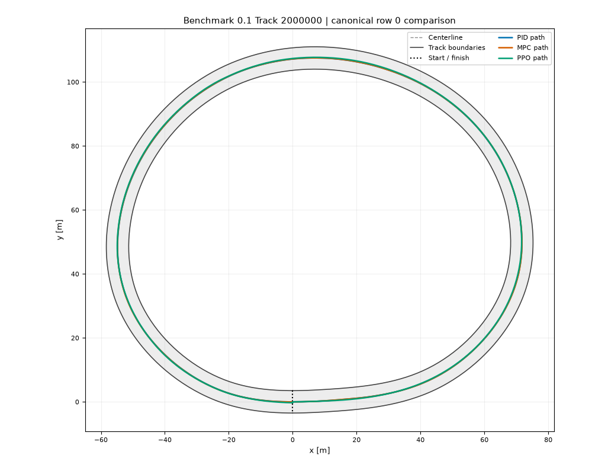
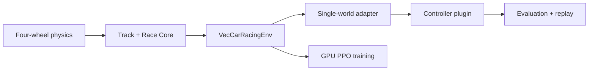

# Controller Learning

[](https://github.com/AojiLi/controller-learning/actions/workflows/ci.yml)
[](https://aojili.github.io/controller-learning/)
[](https://github.com/AojiLi/controller-learning/releases)
[](LICENSE)

**Learn race-car control by building a Controller, running it on procedural Tracks, and comparing
it under one reproducible Challenge.**

Controller Learning is a portfolio-oriented benchmark and teaching platform. A physical
four-wheel car, the task, observations, actions, termination rules, and metrics stay fixed while
the Controller changes. PID, nonlinear MPC, and PPO are included as examples; your Controller is
the point of the project.



*Accepted benchmark `0.1` row-0 trajectories, captured from the same measured M8 rollouts.*

## Quick Start

The supported v0.1.x development path is Linux x86-64, Python 3.11, and
[Pixi](https://pixi.sh/). No separate Python or Conda environment is needed.

```bash
git clone https://github.com/AojiLi/controller-learning.git
cd controller-learning
pixi install
pixi run sim -- --controller controllers/pid --level-id 0 --render
```

To complete the same loop with your own trusted local plugin:

```bash
cp -R controllers/template controllers/my_controller

# Develop on one deterministic Track.
pixi run sim -- --controller controllers/my_controller --level-id 0 --render

# Measure an informal Level 0 rollout and retain its exact trajectory.
pixi run evaluate-controller -- \
  --controller controllers/my_controller \
  --run-id my-level0 \
  --split level0 \
  --capture-row 0

# Render that measured rollout without rerunning the simulation.
pixi run replay -- \
  runs/evaluations/my-level0/selected_replays/row_000_trajectory.json \
  --overview runs/evaluations/my-level0/overview.png
```

The evaluator writes ordered episode rows and a summary under ignored `runs/evaluations/`. It
supports only Level 0 and Validation: benchmark Test is deliberately unavailable to routine
Controller development. See the [Controller workflow](https://aojili.github.io/controller-learning/getting-started/)
for Validation prefixes, GPU execution, output schemas, and interactive replay.

## Accepted Benchmark Result

The frozen `m8-final-v0-1-002` comparison used one shared batch-one MJX-Warp Environment, the same
20 Test Tracks and reset seeds, and a fresh plugin instance for every episode.

| Rank | Controller | Success | Mean successful lap | Mean speed | Lateral RMS | Compute P99 |
| ---: | --- | ---: | ---: | ---: | ---: | ---: |
| 1 | PID | 20/20 | 88.085 s | 4.974 m/s | 0.0211 m | 0.340 ms |
| 2 | MPC | 20/20 | 102.563 s | 4.273 m/s | 0.0381 m | 43.902 ms |
| 3 | PPO | 19/20 | 23.913 s | 18.324 m/s | 0.2205 m | 0.281 ms |

Ranking uses success rate first and mean successful lap time second. PPO completed successful laps
much sooner but its one off-track episode placed it behind the two 20/20 Controllers. That is a
useful speed, tracking-margin, and completion trade-off among these specific examples—not evidence
that one Controller family is generally superior.

[Read the evidence-derived interpretation](https://aojili.github.io/controller-learning/analysis/)
or inspect the canonical [M8 report](benchmarks/v0.1/m8_final_evaluation_report.json) and
[comparison CSV](benchmarks/v0.1/m8_final_results.csv). The analysis page and figure are rebuilt
deterministically from seven hash-pinned, already committed M8 CSV/NPZ files; they do not rerun
Test.

## What Is Reusable



- **One simulation truth:** CPU MuJoCo is the development/reference path; MJX-Warp is the formal
  GPU training and evaluation backend.
- **One Challenge:** classical control, PPO, and evaluation share the same vehicle dynamics,
  Track state, observation/action contract, reward core, and termination logic.
- **A narrow plugin boundary:** a Controller receives public observations, restricted info,
  immutable public configuration, callbacks, and write-only `DebugDraw`—never the Environment or
  simulator internals.
- **Native GPU batching:** `VecCarRacingEnv` advances 1,024 worlds in one JAX/MJX-Warp program; it
  is not a collection of CPU subprocesses.
- **Auditable experiments:** benchmark versions bind Track manifests, seeds, configs, Controller
  identities, raw metrics, reports, and same-rollout trajectories.

The simulation plant is a physical four-wheel car. MPC may use a simplified kinematic model
inside its own prediction horizon, but that model never replaces the Challenge dynamics.

## Included Controllers

| Example | Purpose | Implementation |
| --- | --- | --- |
| PID | Interpretable classical baseline | Curvature speed planning, speed PID, lateral/heading cascade |
| MPC | Model-based constrained control | CasADi/IPOPT Frenet NMPC with bounded solve and fallback |
| PPO | Learned control on the official vector environment | PyTorch training, frozen Validation selection, NumPy-only plugin export |
| Template | Starting point for a new plugin | Minimal lifecycle and `config.toml`; intentionally does not drive |

All four directories use the same documented Controller lifecycle. Start with
[`controllers/template`](controllers/template/README.md), then use the simulation, development
evaluation, and replay commands above.

## Measured Platform Results

These measurements have different scopes and should not be conflated with Controller performance.

| Layer | Formal workload | Reviewed result |
| --- | --- | ---: |
| Four-wheel MJX-Warp physics (M2) | 1,024 worlds × 10,000 steps | 77,751 transitions/s |
| Complete vector Challenge (M4) | 1,024 Tracks × 10,000 steps | 165,633 transitions/s |
| Device-native TrackPool (M5) | 1,024 worlds × 10,000 steps | 210,371.5 transitions/s |
| PPO training (M7) | 10,466,653 valid Train transitions | 56,245.8 valid transitions/s |

The reports record the exact NVIDIA hardware, software versions, compile time, throughput, VRAM,
health gates, and numerical failures. No macOS, Windows, WSL2, multi-GPU, or cross-hardware
performance claim is made.

## Documentation

The hosted [documentation site](https://aojili.github.io/controller-learning/) contains:

- [Controller workflow](https://aojili.github.io/controller-learning/getting-started/) — install,
  author, simulate, evaluate, and replay;
- [Gymnasium and Controller contract](https://aojili.github.io/controller-learning/environment/)
  — observation, action, info, seeds, lifecycle, and backend boundary;
- [Classical Controllers](https://aojili.github.io/controller-learning/controllers/) and
  [PPO training/export](https://aojili.github.io/controller-learning/ppo/);
- [Evaluation Protocol](https://aojili.github.io/controller-learning/evaluation/) and
  [result interpretation](https://aojili.github.io/controller-learning/analysis/);
- [Reproducibility](https://aojili.github.io/controller-learning/reproducibility/) and
  [stability policy](https://aojili.github.io/controller-learning/stability/).

## Evidence Index

| Milestone | Claim | Canonical evidence |
| --- | --- | --- |
| M1 | Stable CPU four-wheel reference | [CPU report](benchmarks/v0.1/m1_cpu_report.json) |
| M2 | Native 1/64/256/1,024-world GPU physics | [GPU report](benchmarks/v0.1/gpu_report.json) |
| M3 | Procedural Track capacity and driveability | [capacity](benchmarks/v0.1/track_capacity_report.json) · [driveability](benchmarks/v0.1/track_driveability_report.json) |
| M4 | Shared Gymnasium vector Challenge | [environment report](benchmarks/v0.1/m4_environment_report.json) |
| M5 | Versioned Train/Validation/Test assets and TrackPool | [admission](benchmarks/v0.1/m5_track_admission_report.json) · [TrackPool](benchmarks/v0.1/m5_track_pool_report.json) |
| M6 | Observation-only PID and MPC | [Controller report](benchmarks/v0.1/m6_controller_report.json) |
| M7 | Official-environment PPO, selection, and export | [selection](benchmarks/v0.1/m7_ppo_selection_report.json) · [export](benchmarks/v0.1/m7_ppo_export_report.json) · [plugin evaluation](benchmarks/v0.1/m7_ppo_controller_evaluation_report.json) |
| M8 | Frozen PID/MPC/PPO comparison | [final report](benchmarks/v0.1/m8_final_evaluation_report.json) · [CSV](benchmarks/v0.1/m8_final_results.csv) · [attempt-001 lineage](benchmarks/v0.1/m8_attempt_001_failure_report.json) |

## Scope and Project Status

Version 0.1.1 completes the end-user loop around the already frozen benchmark `0.1`: simulate,
evaluate on Level 0 or Validation, retain a measured trajectory, replay it, and interpret the
published comparison. It does not alter the accepted M8 result or the frozen PID/MPC/PPO plugin
identities.

Linux x86-64 is the only tested platform. Level 2/3, MPCC, perception, multi-car racing,
sim-to-real, ROS/real vehicles, online untrusted submissions, and broad backend abstractions remain
out of scope. See [PROJECT_PLAN.md](PROJECT_PLAN.md) for the confirmed design and
[CHANGELOG.md](CHANGELOG.md) for release history.

## Contributing, Citation, and License

Contributions are welcome within the documented scope; read [CONTRIBUTING.md](CONTRIBUTING.md) and
the [public stability policy](https://aojili.github.io/controller-learning/stability/) first. Cite
the software using [CITATION.cff](CITATION.cff).

The Challenge-layer pattern was inspired by
[learnsyslab/lsy_drone_racing](https://github.com/learnsyslab/lsy_drone_racing). Controller Learning
is an independent race-car implementation and does not vendor the reference source.

Released under the [MIT License](LICENSE).
