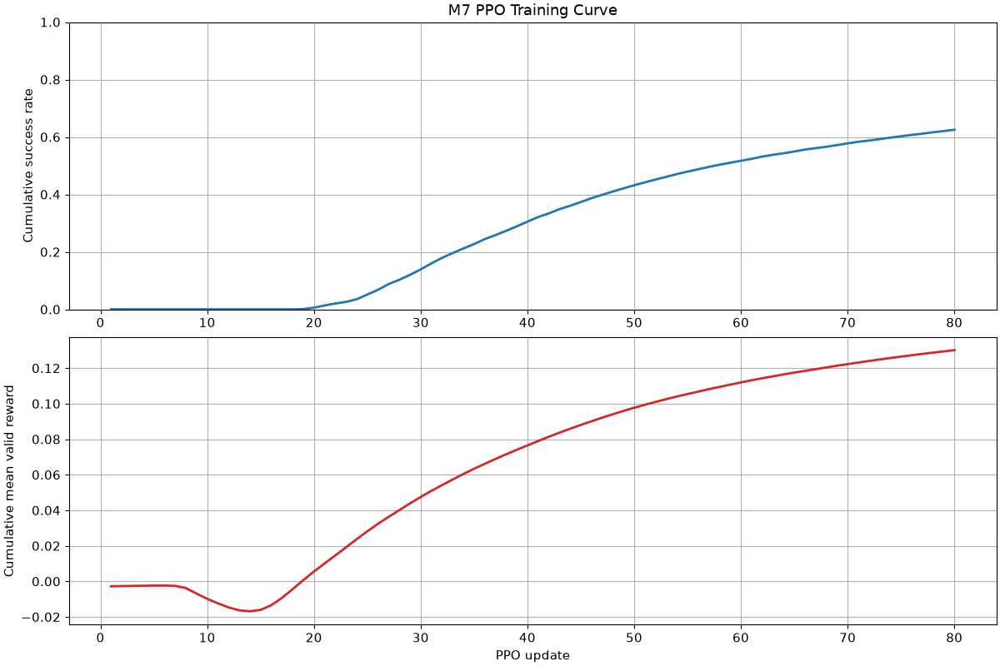
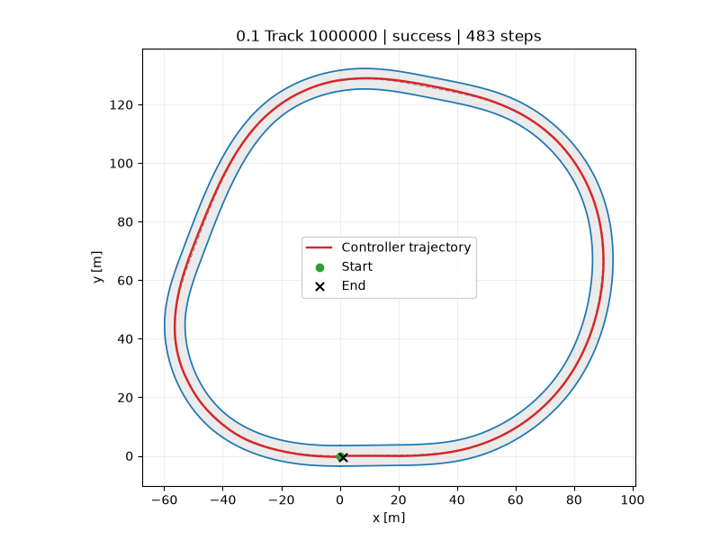

# Controller Learning

**A GPU-parallel race car control benchmark with procedurally generated tracks,
pluggable controllers, and reproducible evaluation.**

Controller Learning is a benchmark and teaching platform for developing and comparing race-car
controllers under one environment, vehicle, task, and evaluation protocol. PID, MPC, and PPO are
implemented as educational examples; the reusable Challenge and Controller interface are the core
product.

> **Project status:** M7 is complete. PPO trained through the official 1,024-world vector
> environment, passed frozen Validation selection, and was exported as an ordinary Torch-free
> Controller plugin. M8 attempt 001 loaded the fixed Test pool but stopped during Environment
> creation, before reset, stepping, Controller construction, or any performance observation. One
> zero-episode infrastructure replacement, attempt 002, is frozen and pending. No formal Test
> comparison has been published, and the public v0.1 release remains pending.

Reviewed machine-readable evidence is available in the
[M1 CPU report](benchmarks/v0.1/m1_cpu_report.json) and
[M2 GPU report](benchmarks/v0.1/gpu_report.json). M3 evidence is in the
[track-capacity report](benchmarks/v0.1/track_capacity_report.json) and
[track-driveability report](benchmarks/v0.1/track_driveability_report.json). The complete M4
environment path is measured in the
[M4 environment report](benchmarks/v0.1/m4_environment_report.json). M5 evidence is in the
[Track admission report](benchmarks/v0.1/m5_track_admission_report.json) and
[TrackPool GPU report](benchmarks/v0.1/m5_track_pool_report.json). Classical Controller evidence is
in the [M6 Controller report](benchmarks/v0.1/m6_controller_report.json). PPO evidence is in the
[M7 selection report](benchmarks/v0.1/m7_ppo_selection_report.json),
[export report](benchmarks/v0.1/m7_ppo_export_report.json), and
[ordinary Controller report](benchmarks/v0.1/m7_ppo_controller_evaluation_report.json). The
canonical [M8 attempt 001 failure report](benchmarks/v0.1/m8_attempt_001_failure_report.json)
records the retained zero-episode infrastructure failure and the exact authorization boundary for
attempt 002.

## Why This Project Exists

Control approaches are difficult to compare when each example uses a different vehicle model,
track, observation, action, or success definition. This project is designed to make those choices
explicit and reproducible:

- a physical four-wheel race car as the simulation truth;
- native GPU-batched simulation for reinforcement learning;
- fixed and procedurally generated closed-loop tracks;
- a small directory-based Controller plugin interface;
- the same official environment for classical control, training, and evaluation; and
- public benchmark tracks, seeds, manifests, metrics, and replays.

## v0.1 Stack

- MuJoCo MJCF and MJX-Warp
- JAX and Gymnasium
- CasADi/IPOPT for MPC
- PyTorch for PPO
- Pixi on Linux with Python 3.11

Controller success rates below are documented only where the corresponding milestone benchmark
passed.

The [Classical Controllers tutorial](docs/controllers.md) explains the Controller lifecycle,
observation-only geometry, PID and MPC designs, DebugDraw output, and timing interpretation.
The [PPO tutorial](docs/ppo.md) covers the official training stack, DLPack exchange, NEXT_STEP
rollout masks, frozen checkpoint selection, NumPy export, and replay.
The [Evaluation Protocol](docs/evaluation.md) defines the fixed M8 PID/MPC/PPO comparison, ranking,
metrics, same-rollout replay, and single authorized replacement policy. The
[Reproducibility Guide](docs/reproducibility.md) separates CPU development from formal NVIDIA GPU
work and explains how to add a Controller without tuning on Test.

## Development Setup

Pixi is the only supported environment workflow for v0.1.

```bash
pixi install
pixi run ci
```

Run the template Controller through one complete development episode:

```bash
pixi run sim
```

The NVIDIA environment is installed separately so CPU development and CI do not resolve or install
CUDA/PyTorch dependencies:

```bash
pixi install -e gpu
pixi run -e gpu gpu-check
pixi run -e gpu gpu-tests
```

These commands are verified as part of M0. Linux x86-64 with glibc 2.28 or newer is the only
supported v0.1 platform; macOS, native Windows, and WSL2 are future work.

## Add a Controller

Start from `controllers/template`, keep algorithm-specific settings in the plugin's `config.toml`,
and implement the public `Controller` lifecycle. A plugin may use public observations, restricted
info, immutable public configuration, and write-only `DebugDraw`; it cannot read Environment,
Race Core, TrackPool, or simulator internals.

Develop first on Level 0 or generated Level 1 seeds:

```bash
cp -R controllers/template controllers/my_controller
pixi run sim -- --controller controllers/my_controller --level-id 0 --render
pixi run sim -- --controller controllers/my_controller --level-id 1 --track-seed 42
```

Use Train for learning and Validation for selection. Benchmark `0.1` Test is reserved for final
reporting and must not drive tuning, checkpoint selection, or Controller changes. See the
[Reproducibility Guide](docs/reproducibility.md) for the full workflow.

## Architecture

The repository separates five responsibilities:

1. **Physics** advances the four-wheel vehicle.
2. **Track** owns deterministic geometry, validation, and benchmark pools.
3. **Challenge** defines observations, actions, progress, reward, reset, and termination.
4. **Controller** contains trusted plugins that only use the public interface.
5. **Evaluation** produces reproducible metrics, manifests, plots, and replays.

PPO trains directly against the official `VecCarRacingEnv`; the project does not maintain a second
simplified training environment.

## Verified GPU Result

The formal M2 run used an NVIDIA GeForce RTX 5070 Ti Laptop GPU and the locked Pixi environment. It
completed 10,000 environment steps with 1,024 native worlds: 10,240,000 transitions and 102,400,000
world-physics steps. The measured rate was 77,751 transitions/s with 346 MiB peak process VRAM and
no long-window process-VRAM growth. All states remained finite, all four wheel contacts stayed
within the physical gates, and no buffer overflow, unexpected contact, or runtime warning occurred.

This is the M2 physics-layer result. M3 subsequently validated track geometry and independent Race
Core state, and M4 exposed them through Gymnasium. PPO training belongs to M7 and is not implied by
the M2 result.

## Verified M3 Track and Race Core Result

The M3 capacity sweep evaluated 10,000 contiguous seeds at each of 0.75 m, 1.0 m, and 1.25 m arc
spacing. The selected 1.0 m representation generated 9,994 candidates, accepted 9,965 after
validation, and reproduced all eight sampled seeds exactly. Six candidates were outside the length
range and 29 exceeded the curvature limit. The 600 m length bound requires at most 601 stored points
and 40 checkpoints; the locked capacities are 640 points and 48 checkpoints.

One 1,024-world `TrackBatch` occupies 26.641 MiB and a 10,000-track numerical pool occupies 260.162
MiB. The 1.0 m spacing preserves more geometry resolution than 1.25 m while avoiding the additional
memory cost of 0.75 m, so it is the measured resolution/memory balance for v0.1.

GPU tests passed with 1,024 distinct tracks using the same compiled Race Core executable. Masked
track replacement and race reset preserved unselected worlds, and perturbing one world through a
16-step rollout left the other 1,023 worlds bit-exact. The observed peak JAX allocation was about
140.4 MB. A separate formal MJX-Warp driveability run completed all 16 generated tracks at a 4 m/s
target with 0.239 m maximum lateral error, no failure outcome, and no numerical or buffer fault over
46,400 transitions. See [Tracks and Race Core](docs/tracks.md) for the contract and protocol.

## Verified M4 Environment Result

`CarRacingEnv` and `VecCarRacingEnv` now share one Challenge state machine. The registered ID is
`ControllerLearning/CarRacing-v0`; the vector path retains leading JAX arrays and strict Gymnasium
NEXT_STEP masked autoreset. Controllers are loaded from trusted directories, instantiated fresh for
every episode, and receive only public observations, restricted info, immutable public config, and
write-only `DebugDraw`.

The formal M4 run placed 1,024 different validated tracks in one MJX-Warp environment and executed
10,000 environment steps: 10,240,000 transitions in 61.824 seconds, or 165,633 transitions/s. The
separate health run observed timeout and subsequent independent autoreset for all 1,024 worlds, with
no unexpected termination or non-finite public output. Warm active and mixed-autoreset steps passed
JAX transfer guards that disallow both host-to-device and device-to-host transfers.

Peak sampled process VRAM was 556 MiB. The measured steady segment grew by 10 MiB against a 64 MiB
gate. First-step compilation took 1.698 seconds on the recorded NVIDIA GeForce RTX 5070 Ti Laptop
GPU. These are zero-action environment-throughput measurements, not Controller performance claims.
See [Gymnasium and Controller Platform](docs/environment.md) for the API and protocol.

## Verified M5 Level Assets and TrackPool Result

M5 publishes one deterministic Level 0 ellipse with reserved numeric Track ID `UINT32_MAX`, plus
three disjoint Level 1 namespaces:

| Split | Published Tracks | Allowed seed range |
| --- | ---: | --- |
| Train | 10,000 | `[0, 1,000,000)` |
| Validation | 100 | `[1,000,000, 2,000,000)` |
| Test | 20 | `[2,000,000, 3,000,000)` |

All four manifests are committed. Level 0, Validation, and Test NPZ assets are also committed and
packaged; the 272,800,000-byte Train pool is reconstructed into the ignored local cache
`.track-cache/v0.1/train_pool.npz` and verified against its manifest hash. Formal admission selected
the 10,000 Train Tracks from 11,306 ascending-seed candidates after 42 geometry and 1,220 physical
driveability rejections; 44 additional valid candidates in the final fixed-size GPU batch were
recorded as quota extras. The complete admission took 1,266.411 seconds, including 1,116.205 seconds
and 54,161,408 transitions on the four-wheel GPU backend at 48,522.822 transitions/s. All official
Tracks, split-disjointness checks, artifact hashes, and serialized readback gates passed.

The formal TrackPool headline epoch ran 1,024 worlds for 10,000 steps: 10,240,000 transitions in
48.6758 seconds, or 210,371.5 transitions/s. The matched fixed-Track baseline measured 219,604.7
transitions/s, giving a 0.958 throughput ratio. The strengthened memory protocol ran E0 through E3
for 40,960,000 total transitions on one environment. The first long run exposed a one-time 524 MiB
allocator expansion; after E0, process VRAM, allocator pool size, and allocator peak growth were all
zero through E3. Peak sampled process VRAM was 1,334 MiB. Health, reset-heavy, transfer, JIT-cache,
source, and privacy gates also passed. These are environment and asset results, not Controller
success claims. See [Tracks and Race Core](docs/tracks.md) for the asset and sampling contracts.

## Verified M6 PID and MPC Result

M6 adds observation-only geometry and speed-planning utilities, an interpretable cascaded PID, and
a constrained CasADi/IPOPT nonlinear MPC. Both are ordinary Controller directory plugins and use
the same public observation, action, config, callback, and `DebugDraw` interfaces available to a
new user Controller. The four-wheel MJX-Warp vehicle remains the simulation truth; MPC's Frenet
kinematic model exists only inside that Controller.

The formal report passed all 34 gates. PID completed Level 0 and all 10 fixed Validation-prefix
Tracks. MPC completed Level 0 and 95 of all 100 fixed Validation Tracks; the five failures were
timeouts, with no off-track or invalid-action termination. MPC compute time over Level 0 plus
Validation measured 32.373 ms P50, 39.892 ms P95, and 44.347 ms P99, with a 0.0967% miss rate
against the 50 ms soft deadline. PID P99 was 0.401 ms with no misses.

The sequential closed-loop run checked 234,358 public transitions and 2,343,580 physics substeps
without a non-finite public value or invalid action. Four batch-one environment backends served 112
fresh Controller instances. Peak sampled process VRAM was 396 MiB, and JAX live bytes returned to
zero after each controller/split group. Only Level 0 and Validation assets were loaded; Test was not
accessed. See [Classical Controllers](docs/controllers.md) for the designs and measurement scope.

## Verified M7 PPO Result

The formal run `m7-formal-v0-1-001` trained one PyTorch PPO through public wrappers around a
long-lived 1,024-world `VecCarRacingEnv`. It completed 80 updates and 10,466,653 valid Train
transitions at 56,245.788 end-to-end valid transitions/s, including configured durable logging and
checkpoint boundaries. The final update's recent Train success rate was 0.9513, and peak sampled
process VRAM was 1,180 MiB.

Frozen Validation selection evaluated eight predeclared checkpoints without gradient updates.
Update 70 completed 95 of 100 Tracks with a 24.331579 s mean successful lap time; the seeded
uniform-random baseline completed 0 of 100. The selected actor was exported as a canonical
120,968-byte NumPy policy with SHA-256
`f3054e95c6d357f571425ad69b9ac16c713e24b9f09b7768e7a648af84731a4b`. The ordinary batch-one
Controller Runner then completed 99 of 100 Validation Tracks, with a 24.316667 s mean successful
lap time and 0.260/0.305/0.332 ms compute P50/P95/P99 across 48,709 calls. There were no 50 ms
deadline misses; peak sampled process VRAM was 364 MiB.

The 100-world selection and batch-one Controller runs are separate execution protocols. MJX-Warp
contact and constraint atomics are not rollout-bit-deterministic, so closed-loop trajectories are
not claimed to be bit-identical across widths or repeated runs. The policy was frozen in both
phases, so the result difference does not represent additional learning. Neither phase evaluated a
Controller on Test.



The published replay is Validation row 0 (Track ID `1000000`), captured directly from its
483-step evaluated episode:



See [PPO: GPU Training to Controller Plugin](docs/ppo.md) for the method, commands, artifact chain,
and measurement scope. Final Test evaluation and the PID/MPC/PPO comparison remain M8 work.

## M8 Final Evaluation Protocol — Results Pending

The frozen design evaluates PID, MPC, and PPO in that order on Test manifest rows 0 through 19.
All 60 episodes use one shared batch-one MJX-Warp Environment; each episode receives a fresh plugin
instance. Every Controller sees the same Track order and reset seeds `0..19`, with independent
Controller seeds derived by the public domain-separated `SeedSequence` contract. The same row
therefore produces the same Controller seed for all three algorithms, while the episode and
Controller randomness domains remain separate.

Ranking is success rate descending, then mean successful lap time ascending. There is no combined
score and no minimum success-rate release gate. The evaluator also records tracking error, speed,
raw requested-action saturation and smoothness, Controller compute timing, failure causes, and
per-Track results. The predeclared replay is Test row 0 for every Controller and is retained from
the canonical measured rollout—never from a second simulation or an outcome-selected episode.

The formal release-maintainer command is:

```bash
pixi run -e gpu benchmark-m8-controllers
```

The command is not a tuning loop and is not routine development tooling. It requires a clean
committed source revision, crosses an irreversible Test boundary, and refuses automatic retry.
No formal Test result is published yet. See the [Evaluation Protocol](docs/evaluation.md) for exact
definitions and crash/retry behavior.

## Roadmap

The implementation follows strict milestone gates:

- M0: repository, Pixi, package, tests, CI, and configuration schemas — complete
- M1: stable CPU MuJoCo four-wheel car — complete
- M2: MJX-Warp 1/64/256/1024-world GPU go/no-go — complete
- M3: batched tracks and Race Core — complete
- M4: Gymnasium environments and Controller platform — complete
- M5: Level 0/1 and versioned track pools — complete
- M6: PID and MPC — complete
- M7: PPO on the official vector environment — complete
- M8: frozen final Test evaluation, public documentation, and v0.1 release — active; Test results
  pending

The detailed confirmed design is recorded in [PROJECT_PLAN.md](PROJECT_PLAN.md).

## Inspiration

The Challenge-layer design is inspired by
[learnsyslab/lsy_drone_racing](https://github.com/learnsyslab/lsy_drone_racing). This repository is
an independent race-car implementation and does not vendor the reference source.

## License

Controller Learning is released under the [MIT License](LICENSE).
