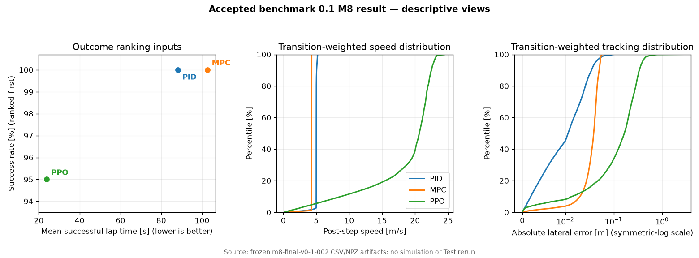

<!-- Generated by scripts/analyze_m8_results.py. Do not edit by hand. -->
# Reading the benchmark 0.1 result

!!! info "Interpretation, not new benchmark evidence"
    This page deterministically describes the already accepted `m8-final-v0-1-002` artifacts.
    Its build path reads only the seven hash-pinned CSV/NPZ files listed below. It does not load a
    Track asset, create an Environment, run a Controller, or access Test again.

The benchmark ranks **success rate first**, then mean lap time over successful episodes. That rule
is essential to reading the result: PPO recorded much shorter successful laps, but its 19/20
completion rate places it behind the two 20/20 Controllers.

| Rank | Controller | Success | Mean successful lap | Median successful lap | Mean speed | Lateral RMS | Compute P99 |
| ---: | --- | ---: | ---: | ---: | ---: | ---: | ---: |
| 1 | PID | 20/20 | 88.085 s | 87.500 s | 4.974 m/s | 0.0211 m | 0.340 ms |
| 2 | MPC | 20/20 | 102.563 s | 101.900 s | 4.273 m/s | 0.0381 m | 43.902 ms |
| 3 | PPO | 19/20 | 23.913 s | 23.750 s | 18.324 m/s | 0.2205 m | 0.281 ms |



## What the accepted samples show

- **PID and MPC occupy the reliable, lower-speed end of this particular comparison.** Both
  completed all 20 Tracks. PID was faster than MPC on every paired Track, by
  14.478 s on average (paired median 14.400 s).
- **PPO occupies the higher-speed, lower-tracking-margin end.** Its mean successful lap time was
  27.1% of PID's and its transition-weighted mean speed was
  3.68 times PID's. It was faster on all 19 Tracks where both PPO and PID
  succeeded, and on all 19 shared successes with MPC.
- **The speed came with a visibly wider tracking-error distribution.** PPO's transition-weighted
  lateral RMS was 10.5 times PID's. Its single unsuccessful episode was an
  `off_track` termination on row 14, Track ID
  `2000016`; that episode is included in the transition distributions.
- **Runtime cost differs sharply by implementation.** PID and exported NumPy PPO had sub-millisecond
  compute P99 values. MPC's P99 was 43.902 ms against
  the 50 ms diagnostic deadline, with 40 misses in
  41,025 calls. Timing is hardware- and run-specific; it is
  not a general real-time guarantee.

These observations make the table useful for teaching: the ranking deliberately refuses to trade
one failure for faster successful laps, while the auxiliary metrics expose the behavior hidden by
rank alone. They do **not** show that PID is generally superior to reinforcement learning, that PPO
is generally faster, or that these three points establish a controller-family Pareto frontier.

## Scope and limitations

This is a descriptive comparison of three frozen example implementations and configurations on one
fixed 20-Track benchmark set. It is not a matched-speed ablation, a causal study of algorithm
families, or a confidence claim about a broader population. Transition distributions weight every
recorded simulation step, so longer episodes contribute more samples. Lap-time summaries contain
successful episodes only. Read the [Evaluation Protocol](evaluation.md) for the exact metric,
ranking, split, and attempt-lineage definitions.

No Controller or benchmark configuration was changed from this interpretation. Future Controller
work must use Train and Validation; these accepted Test outcomes are reporting data, not tuning
feedback.

## Deterministic derivation

Regenerate the page and figure, then verify that the committed bytes are current:

```bash
pixi run build-result-analysis
pixi run check-result-analysis
```

The figure SHA-256 is `09224c06f5d844ca095b0c6de6ad8726ef16bbc7a7763f16d8961615b0ff9e33`. The generator recomputes central success, lap-time, speed,
lateral-error, saturation, timing, Track-order, reset-seed, and episode-boundary claims from the
underlying rows and arrays before it writes anything.

| Frozen input | SHA-256 |
| --- | --- |
| `benchmarks/v0.1/m8_final_results.csv` | `a6d5a7425d1c1091ba3111c722b607f9f60398d8e444e9943c80d27042de7a04` |
| `results/0.1/pid/m8-final-v0-1-002/results.csv` | `bce37414510ef1f4c865c19fbc69e45a74c475b94137eda9c1f9a6ba3fa0f44d` |
| `results/0.1/pid/m8-final-v0-1-002/metrics.npz` | `5b09f33ffebf2268ae02dbbd43ac08daf8fded8fe3a7e294b6973eb363d31466` |
| `results/0.1/mpc/m8-final-v0-1-002/results.csv` | `bd561a80f5eb7653361c5306fe67c9a240d99a23a718c0d0d2d450155a2d27ed` |
| `results/0.1/mpc/m8-final-v0-1-002/metrics.npz` | `fcb70ab25e5413abe3da7787a9677f06944532a17c9b4cfaa4fb2065c31286c8` |
| `results/0.1/ppo/m8-final-v0-1-002/results.csv` | `9dad0feab09c7df1bba5bd627c3d02d81707f00fa4283f49e592637d671b7fd8` |
| `results/0.1/ppo/m8-final-v0-1-002/metrics.npz` | `c1117be7dabbec489d468a288cbecbff6d99b3c238a28542f8d1940beadadd6f` |
