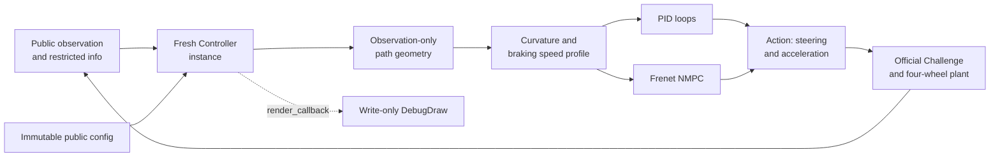

# Classical Controllers: PID and MPC

Controller Learning includes two classical examples built on the same public Challenge contract:
an interpretable PID Controller and a constrained nonlinear MPC. Both drive the physical
four-wheel simulation. The MPC's kinematic model is only an internal prediction model; it does not
replace the simulation truth.

This page explains how the examples are assembled and how to inspect them without using hidden
Track, Race Core, Environment, or simulator state.

## Run the examples

Install the default Pixi environment, then run either Controller on the fixed Level 0 Track:

```bash
pixi install
pixi run sim -- --controller controllers/pid --level-id 0 --render
pixi run sim -- --controller controllers/mpc --level-id 0 --render
```

`--render` is optional. It opens the public-observation 2D renderer and enables the Controller's
`DebugDraw` annotations. To try one exact procedural Level 1 seed on the CPU development backend:

```bash
pixi run sim -- --controller controllers/pid --level-id 1 --track-seed 42
pixi run sim -- --controller controllers/mpc --level-id 1 --track-seed 42
```

The formal backend is MJX-Warp in the GPU Pixi environment:

```bash
pixi install -e gpu
pixi run -e gpu sim -- \
  --controller controllers/mpc \
  --level-id 0 \
  --backend mjx_warp
```

The CPU backend is for development and bounded consistency checks. A successful development
episode is useful evidence while tuning, but it is not a formal benchmark result.

## Controller contract and lifecycle

A plugin is a trusted directory with `controller.py`, `config.toml`, and optional helper modules or
assets. `controller.py` must expose exactly one concrete subclass of
`controller_learning.control.Controller`.

For every episode, the Runner performs this lifecycle:

1. reset the Environment and restrict the returned info to the public whitelist;
2. import the plugin and load its TOML configuration;
3. construct a fresh `Controller(obs, info, config)` instance;
4. call `compute_control(obs, info)` once per 0.05 s control step;
5. pass the transition to `step_callback(...)`;
6. when rendering, call `render_callback(debug_draw)` and drain its commands; and
7. call `episode_callback()` once when the episode ends.

The Controller returns a float32 action in physical units:

```text
[steering_angle_rad, longitudinal_acceleration_mps2]
```

It receives only the public observation, restricted info, and an immutable public configuration.
Challenge-owned values such as the vehicle and action limits are top-level config entries. The
plugin's complete TOML document is nested below `config["controller"]`, so it cannot replace Level,
Track, actuator, or evaluation settings. A Controller never receives an Environment, renderer,
TrackPool, Race Core, MJX data, or simulator reference. Plugins are trusted local code in v0.1 and
are not sandboxed.



## Shared public geometry and speed planning

Both examples first build a `CenterlineReference` from the observation's centerline, boundaries,
valid-prefix mask, and Track length. The helper validates and copies the valid geometry into
read-only NumPy arrays. It then provides:

- periodic sampling and preview by centerline arc length;
- centerline tangent and curvature estimates;
- left and right boundary samples; and
- closest-segment projection, with a local segment hint to remain stable around the closure seam.

The projection produces arc length, projected point, tangent, and signed lateral error. Positive
lateral error is left of the directed centerline. This is Controller-derived state: the Challenge
does not expose its own projection index, lateral error, checkpoint state, or target speed.

The shared curvature planner first applies the lateral-acceleration speed limit

```text
v_curve = sqrt(maximum_lateral_acceleration / abs(curvature))
```

and clips it to the configured minimum and maximum speed. A backward pass then ensures an earlier
sample can brake to every later curvature limit:

```text
v[i] <= sqrt(v[i + 1]^2 + 2 * braking_deceleration * distance_step)
```

The PID uses the first value as its current speed target. The MPC interpolates the same profile
onto its prediction horizon.

## PID Controller

The PID example separates longitudinal and lateral control.

### Longitudinal flow

1. Preview centerline curvature ahead of the current projection.
2. Build the curvature-limited, braking-feasible speed profile.
3. Compute target-speed error and a low-pass-filtered speed derivative.
4. Use a speed PID to request longitudinal acceleration.
5. Bound the request by the public acceleration and deceleration limits.

The derivative term acts on the measured speed with a negative sign, avoiding a derivative kick
when the target changes. The integral state is explicitly bounded. Conditional integration accepts
a candidate integral update only when it would not push an already saturated output farther into
saturation. This is the example's anti-windup mechanism.

### Lateral flow

1. Project the rear-axle position onto the observed centerline.
2. An outer lateral PID maps lateral position error and lateral velocity to a bounded heading
   correction.
3. Curvature feedforward requests approximately `atan(wheelbase * curvature)` steering.
4. An inner heading PD adds heading-error and yaw-rate feedback.
5. Steering-angle and steering-rate limits bound the final request.

The PID TOML is divided into three tables:

| Table | Main responsibility |
| --- | --- |
| `[longitudinal]` | Cruise/corner speed, curvature preview, braking envelope, speed PID, derivative filter, and integral limit |
| `[lateral]` | Projection window, outer lateral PID, heading-correction bound, inner heading PD, and curvature feedforward |
| `[debug]` | Number of preview points submitted to `DebugDraw` |

Tune one Controller-wide parameter set rather than tuning per Track. A practical order is to begin
with conservative speed-planner limits, stabilize the outer lateral and inner heading loops, and
only then increase speed or refine the speed PID.

## MPC Controller

The MPC example creates one fixed CasADi nonlinear-program graph per episode and supplies new
numerical state and path parameters at each step. IPOPT solves the program.

### Frenet prediction model

The state is `[lateral_error, heading_error, speed]`; the control is
`[steering_angle, longitudinal_acceleration]`. With centerline curvature `kappa` and wheelbase `L`,
the continuous model is:

```text
path_rate        = v * cos(heading_error) / (1 - kappa * lateral_error)
lateral_error'   = v * sin(heading_error)
heading_error'   = v / L * tan(steering_angle) - kappa * path_rate
speed'           = longitudinal_acceleration
```

RK4 integrates the model at the public 0.05 s control period. The default 20-step horizon therefore
covers one second. The physical plant remains the four-wheel MuJoCo/MJX-Warp car, so model mismatch
is part of the control problem.

### Objective and constraints

The stage objective penalizes lateral error, heading error, target-speed error, acceleration,
steering and acceleration changes, and deviation from a stabilizing steering reference. That
reference combines kinematic curvature feedforward with lateral and heading feedback. Terminal
costs penalize the three state errors at the end of the horizon.

The nonlinear program enforces:

- the measured initial state and RK4 dynamics equalities;
- speed between zero and the public vehicle maximum;
- public steering-angle, steering-rate, acceleration, and deceleration limits; and
- future lateral error inside the observed Track boundaries, reduced by half the vehicle width
  and the configured safety margin.

The MPC TOML groups horizon shape, observation-derived planning, objective weights, solver limits,
feedback/fallback gains, and debug sampling into `[horizon]`, `[planning]`, `[weights]`, `[solver]`,
`[feedback]`, and `[debug]` respectively.

### Bounded iteration, warm start, and fallback

The default solver configuration caps IPOPT at three iterations and sets a 45 ms solver wall-time
limit. A result reported as `Maximum_Iterations_Exceeded` may be used only when a separate check
finds finite decision and constraint values, no wall-time exit, and maximum hard-constraint
violation at or below the configured feasibility tolerance. This is bounded-iteration NMPC; it is
not an SQP real-time-iteration claim and does not by itself prove a 50 ms end-to-end deadline.

After a feasible solve, the primal horizon is shifted for the next call. The implementation blends
25% of the shifted controls with 75% newly computed feedback controls, clips them to the public
limits, and rolls the states forward again from the new measurement. This gives IPOPT a
dynamically consistent starting trajectory.

When the current solve cannot provide an accepted action, the Controller uses this deterministic
order:

1. consume a remaining action from the last accepted feasible plan, if available;
2. otherwise use curvature feedforward plus lateral/heading feedback and proportional speed
   feedback; and
3. apply steering-angle, steering-rate, acceleration, and deceleration bounds again.

The rendered status distinguishes `mpc-converged`, `mpc-bounded`, `shifted-plan`, and
`feedback-fallback`. These modes explain which source produced the action; they are not benchmark
outcomes.

## DebugDraw

`render_callback` receives only a writer with `line`, `points`, and `text` methods. The PID example
draws the projection, preview samples, lookahead target, target speed, and tracking errors. The MPC
adds its horizon reference and predicted path plus solver/action-source status. Commands are
drained after each rendered frame. Headless evaluation never invokes the callback, so drawing does
not enter Controller timing or affect formal results.

This write-only design is deliberate: visualization can explain a Controller without becoming a
route back to simulator truth.

## Read results and timing correctly

The single-episode `sim` command prints JSON. Start with these fields:

- `lap_completed` and `lap_time_s` describe success and lap time;
- `termination_reason`, `terminated`, and `truncated` describe how the episode ended;
- `level_id`, `track_id`, `track_seed`, and `environment_seed` identify the run; and
- `total_reward` is a diagnostic training signal, not the benchmark ranking score.

The Runner measures plugin import time, Controller initialization time, and every complete
`compute_control` call. The evaluator summarizes compute samples as P50, P95, P99, maximum,
deadline-miss count, and deadline-miss rate. A miss is a call strictly longer than the configured
50 ms soft deadline. Import and initialization are recorded separately and do not count toward lap
time or per-step compute percentiles.

Run the locked formal M6 protocol only from the GPU environment:

```bash
pixi run -e gpu benchmark-controllers
```

It evaluates both Controllers on Level 0, the PID on the fixed prefix of 10 Validation Tracks, and
the MPC on all 100 fixed Validation Tracks. It does not load or evaluate the Test split. The
generated report path is `benchmarks/v0.1/m6_controller_report.json`. Each controller/split group
reuses one batch-one MJX-Warp environment while the Runner constructs a fresh Controller for every
episode. Validation Tracks are selected in manifest order from a verified immutable pool; reset and
Controller seeds remain the fixed row-index seeds.

In that report, interpret `success_rate` before successful-lap mean time, then inspect per-Track
termination reasons and timing. The real-time diagnostic requires P99 at or below 50 ms and a miss
rate at or below 1%; it is reported separately and is not itself an M6 pass gate. Treat a result as
formal evidence only when the report exists, its top-level `status` is `pass`, and its source,
asset, protocol, runtime, privacy, and recomputation checks pass. The implementation or one local
episode is not a substitute for that evidence.

## Dependency licenses

The repository's MIT license covers Controller Learning's own source. It does not replace the
licenses of external solver dependencies. The locked Pixi package metadata identifies
[CasADi 3.7.2](https://github.com/casadi/casadi) as `LGPL-3.0-or-later` and
[Ipopt 3.14.19](https://github.com/coin-or/Ipopt) as `EPL-1.0`. Their own license terms and the
terms of their transitive dependencies apply independently; consult the installed package metadata
and upstream distributions before redistributing binaries.
