# PPO: GPU Training to Controller Plugin

M7 trains one PyTorch PPO policy on the official GPU-batched Challenge, selects a frozen
checkpoint on Validation, and exports that checkpoint as an ordinary single-environment
Controller. The training path does not replace the four-wheel plant or maintain a second RL
environment.

M7 and the final M8 evaluation are complete. The frozen PPO plugin completed 19/20 Test Tracks in
the accepted comparison; it was not retrained or reselected after Validation. The full result and
attempt lineage are documented in the [Evaluation Protocol](evaluation.md).

## End-to-end path

```mermaid
flowchart LR
    TRAIN["10,000-Track Train pool"] --> ENV["VecCarRacingEnv<br/>1,024 MJX-Warp worlds"]
    ENV --> REWARD["Public reward wrapper"]
    REWARD --> FEATURES["Public 100-value<br/>local-track encoder"]
    FEATURES --> BRIDGE["JAX ↔ Torch<br/>DLPack bridge"]
    BRIDGE --> PPO["PyTorch PPO"]
    PPO --> CANDIDATES["Updates 10…80"]
    CANDIDATES --> VALIDATION["Frozen Validation<br/>selection"]
    VALIDATION --> EXPORT["Canonical NumPy actor"]
    EXPORT --> PLUGIN["controllers/ppo"]
    PLUGIN --> RUNNER["Ordinary batch-one<br/>Controller Runner"]
    RUNNER --> REPLAY["Report and replay"]
```



The formal wrapper order during optimization is:

```text
VecCarRacingEnv
  -> PublicRewardShapingVecEnv
  -> LocalTrackObservationVecEnv
  -> JaxToTorchVecEnv
```

`VecCarRacingEnv` remains the only Challenge state machine. The reward wrapper derives shaping
terms from public observations and actions. The feature wrapper derives a versioned 100-value
float32 vector from body velocity, yaw rate, steering angle, and 16 body-frame samples of the
observed centerline and boundaries. It does not read a TrackPool row, Race Core state, projection
index, MJX state, or simulator object.

## DLPack and NEXT_STEP accounting

Numerical observations, actions, rewards, flags, and numeric public info cross between JAX and
Torch through same-device DLPack views. The public `benchmark_version` string remains a validated
string because DLPack has no string dtype. The hot numerical path does not use a per-step NumPy or
`device_get` copy.

Gymnasium `NEXT_STEP` autoreset makes the call after a terminal transition a reset-only slot for
that world. Other worlds still advance on the same vector step. The collector therefore maintains
two complementary masks:

- `valid_transition` includes active transitions, including a terminal transition;
- `reset_only` marks the following zero-reward reset slot.

Reset-only slots are excluded from reward totals, GAE, advantage normalization, PPO losses, and
valid-transition counts. They also break advantage recursion across episode boundaries. The formal
run recorded 19,107 reset-only slots and 19,110 terminal events; the three-event difference is the
valid pending-reset state at the fixed training boundary.

## Formal Train run

The frozen configuration is [`configs/ppo.toml`](https://github.com/AojiLi/controller-learning/blob/main/configs/ppo.toml).
Run `m7-formal-v0-1-001` used one long-lived 1,024-world MJX-Warp environment and only the verified
10,000-Track Train cache.

| Measurement | Result |
| --- | ---: |
| PPO updates | 80 |
| Vector environment steps | 10,240 |
| Raw world slots | 10,485,760 |
| Valid transitions | 10,466,653 |
| End-to-end valid transitions/s | 56,245.788 |
| Final update recent success rate | 0.9513 |
| Peak sampled process VRAM | 1,180 MiB |

The local run used an NVIDIA GeForce RTX 5070 Ti Laptop GPU with driver 590.48.01, Python 3.11.15,
PyTorch 2.11.0+cu128, JAX/JAXLIB 0.10.2, MuJoCo/MJX-Warp 3.10.0, and Warp 1.13.0. Throughput and
memory figures should be interpreted in that hardware and software context.

The throughput scope includes configured durable CSV, TensorBoard, and checkpoint boundaries. The
recent success rate is a Train episode diagnostic, not the benchmark ranking metric. The run saved
eight predeclared candidate checkpoints at updates 10, 20, ..., 80. Each checkpoint binds the
training config, source revision, Pixi lock, Train manifest/cache, seeds, counters, and optimizer
state. The public [training curve](https://github.com/AojiLi/controller-learning/blob/main/benchmarks/v0.1/m7_training_curve.png)
is generated from the hash-bound run metrics.

The exact formal command was:

```bash
pixi run materialize-track-pool
XLA_PYTHON_CLIENT_PREALLOCATE=false \
  pixi run -e gpu train-ppo -- --run-id m7-formal-v0-1-001
```

Run directories and full training checkpoints are local artifacts under `runs/ppo/` and are not
committed. Published reports bind them by SHA-256 and stable run identity.

## Frozen Validation selection

Validation selection loaded all eight declared checkpoints without optimizer updates and evaluated
their deterministic actions in one 100-world environment. Every policy used the same fixed
Validation Track order and reset seed. Ranking is success count descending, then mean successful
lap time ascending, then update index ascending. A separately seeded uniform-random action policy
was evaluated under the same protocol.

Update 70 was selected with 95 successes in 100 fixed Validation Tracks and a 24.331579 s mean
successful lap time. The seeded random policy completed 0 of 100, so the selected policy passed
both the strict success-count improvement and the configured 0.10 success-rate-margin gates.
Neither Train nor Test assets were opened during this phase.

Run the frozen selection workflow with:

```bash
pixi run -e gpu benchmark-m7-ppo
```

The complete candidate table, per-Track outcomes, source and asset identities, and recomputed gates
are in the [M7 PPO selection report](https://github.com/AojiLi/controller-learning/blob/main/benchmarks/v0.1/m7_ppo_selection_report.json).

## Checkpoint export

The selected actor is published in
[`controllers/ppo`](https://github.com/AojiLi/controller-learning/tree/main/controllers/ppo).
Export removes the optimizer, value network, and all environment state, then serializes the fixed
`100 -> 128 -> 128 -> 2` deterministic actor as a canonical 120,968-byte NumPy NPZ. Runtime
inference uses NumPy and does not import Torch.

The policy SHA-256 is:

```text
f3054e95c6d357f571425ad69b9ac16c713e24b9f09b7768e7a648af84731a4b
```

`config.toml` and `metadata.json` bind that policy to update 70, checkpoint hash, feature schema,
physical action bounds, training config, and source revision. A fresh Controller verifies the
bindings before inference. See the [M7 export report](https://github.com/AojiLi/controller-learning/blob/main/benchmarks/v0.1/m7_ppo_export_report.json)
for the complete provenance chain.

The release-maintainer export command is:

```bash
pixi run -e gpu export-m7-ppo-controller
```

Export is intentionally a one-time activation of an unfinalized template. It refuses to overwrite
the finalized published plugin.

## Ordinary Controller evaluation and replay

The exported policy was then evaluated through the same ordinary Controller loader and Runner used
by other plugins. One reusable batch-one MJX-Warp environment served the 100 fixed Validation
Tracks in manifest order, while the Runner created a fresh PPO Controller for every episode.

| Measurement | Result |
| --- | ---: |
| Validation success | 99 / 100 |
| Mean successful lap time | 24.316667 s |
| Terminations | 99 success, 1 off-track |
| Environment steps | 48,709 |
| Sequential transitions/s | 54.906 |
| Compute P50 / P95 / P99 | 0.260 / 0.305 / 0.332 ms |
| 50 ms deadline misses | 0 / 48,709 |
| Peak sampled process VRAM | 364 MiB |

This is a sequential, host-synchronized Controller measurement; it is not comparable to native
batched training throughput. It also uses a different execution width from the 100-world selection
run. MJX-Warp contact and constraint atomics are not rollout-bit-deterministic; small numerical
differences can compound over hundreds of closed-loop steps. The 95/100 selection result and
99/100 batch-one result are therefore separate protocol measurements, not evidence of additional
learning—the weights were frozen and no gradients ran in either phase.

An initial replay protocol tried to simulate the selected episode a second time. Its strict parity
gate correctly rejected a success-to-off-track divergence and its publication transaction fully
rolled back. Protocol v2 was then frozen in a clean commit: it captures the public trajectory from
the canonical evaluation episode itself, without a retry, second rollout, or outcome cherry-pick.

The replay rule retains the first successful episode in fixed Validation order. Row 0, Track ID
`1000000`, succeeded in 483 steps (484 state frames) with a 24.15 s lap. The trajectory was captured
during that evaluated episode rather than by running a second simulation.

Run the ordinary Controller evidence workflow with:

```bash
pixi run -e gpu benchmark-m7-ppo-controller
```

Published artifacts:

- [ordinary Controller evaluation report](https://github.com/AojiLi/controller-learning/blob/main/benchmarks/v0.1/m7_ppo_controller_evaluation_report.json)
- [replay trajectory JSON](https://github.com/AojiLi/controller-learning/blob/main/benchmarks/v0.1/m7_ppo_replay_trajectory.json)
- [replay overview](https://github.com/AojiLi/controller-learning/blob/main/benchmarks/v0.1/m7_ppo_replay_overview.png)

To inspect the finalized plugin interactively on a development Track:

```bash
pixi run -e gpu sim -- \
  --controller controllers/ppo \
  --level-id 1 \
  --track-seed 42 \
  --backend mjx_warp \
  --render
```

Linux x86-64 with an NVIDIA GPU is the only tested M7/M8 platform. macOS, native Windows, and WSL2
are not yet supported. The accepted cross-Controller Test table is published in the
[Evaluation Protocol](evaluation.md).
